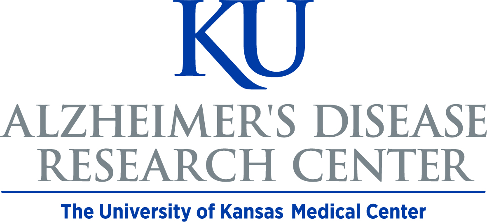

<div style="text-align:center">
  
</div>

# quarto-kansas

**An Unofficial Quarto Theme Extension for the KU Alzheimer's Disease Research Center**

## Getting Started

### Installing the Template

Use the terminal to navigate to the directory you would like to download the template using the `cd` terminal command. Then, type in the following to your terminal to download the template.

```bash
quarto use template bhelsel/quarto-kansas
```
You will be asked if you trust the authors of this template and if you would like to create a subdirectory for this template. Creating a subdirectory will create a new folder within your directory and change the name of the .qmd file to match the name of the subdirectory.

### Editing the YAML and Selecting the Format

Once the .qmd file has been downloaded, you can open the .qmd file at edit the YAML prior to starting your report. You will want to change the author and choose the report format that you would like outputted. Currently, the options are the following:

- kansas-pdf: default
- kansas-docx: default
- kansas-html: default
- kansas-pptx: default

Beamer and revealjs formats may be developed in the future as needs arise. The .pptx format was created by the Recruitment, Outreach, and Engagement Core at the KU Alzheimer's Disease Research Center. 

### Contributing

Feel free to contribute ideas via issues and pull requests or by emailing Brian at <a href="mailto: bhelsel@kumc.edu">bhelsel@kumc.edu</a>.

